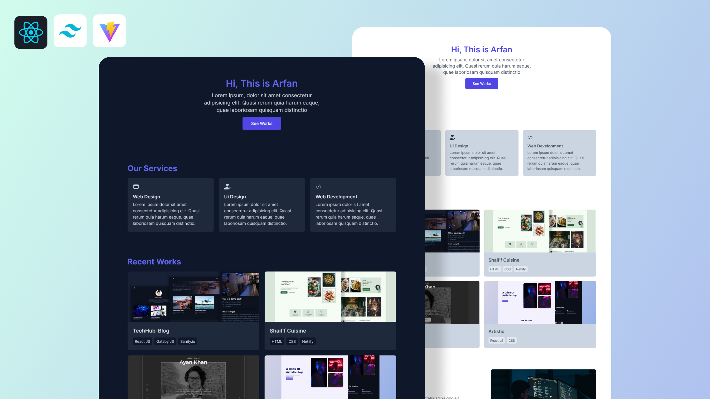

# 💼 Manny Mads — AI & Full-Stack Developer Portfolio

Welcome to my portfolio — a modern, full-stack, AI-powered developer showcase built with **React**, **Tailwind CSS**, and **Vite.js**.  
This isn’t just a site — it’s a statement of technical mastery.

🔗 **Live Demo:** [Coming Soon]  
📫 **Contact:** Chubski17@gmail.com  
📂 **GitHub:** [github.com/Purplerain-source](https://github.com/Purplerain-source)

---

## 👋 Who’s Manny Mads?

I’m **Manny Mads** — an elite-level **AI Developer**, **Full-Stack Engineer**, and automation architect. I build intelligent systems that scale, and interfaces that inspire.

- 🧠 **AI & Machine Learning** — OpenAI, LangChain, Python NLP, RAG pipelines.
- ⚙️ **Full-Stack Development** — React, Node.js, Express, MongoDB, Firebase.
- 🧩 **Workflow Automation** — n8n, Zapier, custom bots, business process pipelines.
- ☁️ **DevOps & Cloud** — Vercel, AWS, Railway, CI/CD.
- 🎨 **UI/UX Engineer** — Tailwind, Framer Motion, Figma, pixel-perfect interfaces.

---

## 🛠️ Tech Stack Highlights

| Category           | Tools & Frameworks |
|--------------------|--------------------|
| Frontend           | React, Tailwind CSS, Framer Motion, Vite |
| Backend/API        | Node.js, Express, Flask, Django |
| AI & Automation    | Python, OpenAI, LangChain, n8n |
| Databases/Auth     | Firebase, Supabase, MongoDB, PostgreSQL |
| Deployment/Cloud   | Vercel, Railway, Netlify, GitHub Actions |
| Developer Tools    | Git, VSCode, Figma, Postman |

---

## 📁 Featured Projects

| Project                    | Description                                           | Stack |
|----------------------------|-------------------------------------------------------|-------|
| **AI Fitness Companion**   | GPT-powered personal trainer with pose tracking       | React, Flask, OpenCV |
| **LegalOps Automation**    | Automated intake + billing flows for law firms        | Node.js, n8n |
| **Crypto Portfolio Tracker**| Live asset analytics with wallet integrations       | React, Firebase, Chart.js |
| **ActFastGlass Website**   | Built & deployed full site for a glazing company      | Next.js, Tailwind CSS |

---

## 🌍 Mission

To design, engineer, and ship AI-native solutions that push boundaries — empowering businesses and creators to scale smarter.

---

## 📝 License

This project is licensed under the [MIT License](https://choosealicense.com/licenses/mit/).

---

**Let’s build something legendary.**  
_— Manny Mads_
